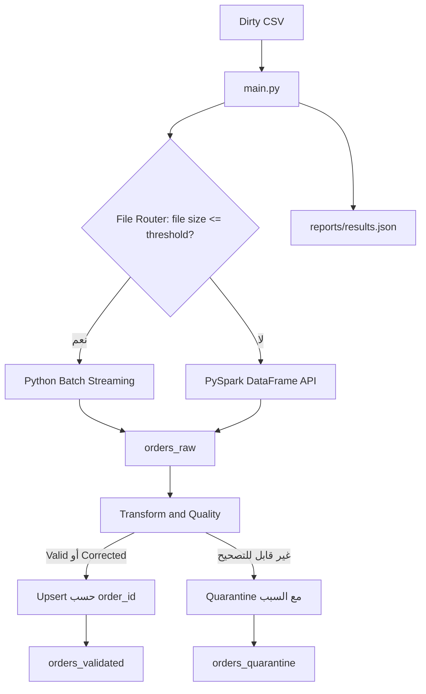

# معمارية خط البيانات

## التدفق العام

## مراحل التنفيذ

تبدأ العملية باكتشاف مسار الملف وحجمه وإنشاء `run_id`. يقرر Router المحرك اعتمادًا على `SMALL_FILE_THRESHOLD_MB`. في الملفات الصغيرة تتم قراءة CSV سطرًا بسطر وتجميعه في دفعات، بينما يستخدم مسار PySpark `SparkSession` وSchema ثابتة وDataFrame API.

في كلا المسارين تُحمّل السجلات إلى `orders_raw` دون تنظيف. هذا يحقق مبدأ ELT ويحافظ على النسخة الأصلية القابلة للتتبع. بعد ذلك يقرأ المصنف Raw ويطبق قواعد الجودة الواضحة فقط. السجل السليم يُصنف `valid`، والسجل الذي تغيرت بعض حقوله يُصنف `corrected` مع Audit Trail، أما الخطأ الجوهري غير القابل للإصلاح فيُصنف `quarantined`.

تُكتب السجلات المقبولة إلى `orders_validated` بعملية Upsert على `order_id` مع Unique Index. وتُكتب سجلات العزل إلى `orders_quarantine` مع `error_codes` و`error_details` ونسخة `raw_record`. يسجل النظام في `reports/results.json` مقاييس كل تشغيل ونتيجة فحص الاتساق.

## قرار الحد الفاصل

الحد الافتراضي هو 200 MB. هذا الحد إعداد قابل للتغيير وليس رقمًا مخفيًا داخل منطق التحميل. يبرر استخدام Python Batch للملف الصغير لأنه يقرأ Streaming دون تحميل الملف إلى الذاكرة، بينما تستفيد الملفات الأكبر من تقسيم العمل إلى Partitions عبر Spark.
